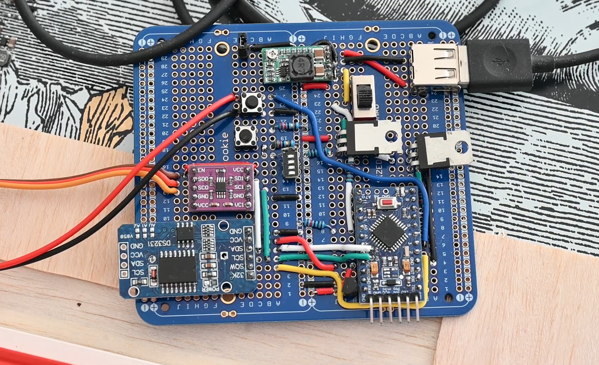

# PiFrame

Battery-powered color e-ink photo frame driven by a Raspberry Pi and an Arduino power controller.

Warning, below has been written by an LLM only lightly edited by me and may not be 100% correct.

## Video and Build Image

- YouTube video: https://www.youtube.com/watch?v=AknCTQES6c4



## What This Project Does

PiFrame updates a 4:3 image on an e-ink screen, then shuts the Raspberry Pi fully off to save power. An Arduino Pro Mini stays alive, watches a button/RTC interrupt, and switches Pi power back on when needed.

High-level behavior:

1. Arduino powers Pi on.
2. Pi runs [Python/imagesd.py](Python/imagesd.py), requests one image from a local CGI endpoint, and renders it to the e-ink display.
3. Pi waits for user input for 45 seconds.
4. If no cancel input is received, Pi sets an RTC alarm and requests shutdown.
5. Arduino receives shutdown request over I2C, waits 10 seconds, then cuts Pi power.
6. RTC alarm (or manual button press) wakes the system for the next update.

## Hardware Architecture

### Core parts

- Raspberry Pi (the transcript notes moving away from original Pi Zero due to boot time; Pi Zero 2 class is more practical).
- Arduino Pro Mini (3.3V variant expected by current voltage logic).
- Pimoroni Inky color display (transcript references 13.3-inch color e-ink panel).
- DS3231 RTC module (alarm interrupt wake).
- LiPo battery pack powering the whole frame.
- DC-DC converter to Pi 5V rail.
- High-side switching stage using one N-channel and one P-channel MOSFET.
- Voltage divider into Arduino A0 for battery telemetry.
- Button on frame side (plus optional duplicate button in parallel).
- I2C buffer/isolator (mentioned in transcript as part of bus-stability work).

### Signals used by current firmware

From [fullFrame/fullFrame.ino](fullFrame/fullFrame.ino):

- `D7`: Pi power switch control.
- `D3`: user button interrupt.
- `D2`: RTC interrupt input.
- `A0`: battery voltage ADC.
- I2C slave address: `0x12`.

From [Python/imagesd.py](Python/imagesd.py):

- Pi local button: GPIO 5 via `gpiozero.Button`.
- I2C bus `1` for Arduino (`0x12`) and DS3231 (`0x68`).

## Software Components

### Main runtime files

- [fullFrame/fullFrame.ino](fullFrame/fullFrame.ino): production Arduino firmware (power switching, sleep, I2C slave protocol, button/RTC interrupts).
- [Python/imagesd.py](Python/imagesd.py): production Pi app (fetch image, display, low-battery warning, RTC alarm setup, controlled shutdown).
- [Python/pics3.cgi](Python/pics3.cgi): image server script (random selection, avoids immediate repeats, portrait handling, blur-fill to 4:3, JPEG response).
- [Python/piframe.service](Python/piframe.service): systemd unit that waits for network readiness, then runs git pull before launching the Python app.

### Supporting/legacy files

- [SleepTimer/SleepTimer.ino](SleepTimer/SleepTimer.ino): RTC sleep/wake experiment sketch.
- [Voltage/Voltage.ino](Voltage/Voltage.ino): battery measurement test sketch.

## I2C Protocol (Pi master -> Arduino slave `0x12`)

Defined by [fullFrame/fullFrame.ino](fullFrame/fullFrame.ino) and consumed in [Python/imagesd.py](Python/imagesd.py):

- `0x01` read: button event (1 once, then cleared).
- `0x02` read: battery voltage encoded as one byte where `volts = raw / 25.0`.
- `0x10` write: Pi is shutting down (Arduino enters delayed power-off state).
- `0x11` write: cancel shutdown (implemented in Arduino).

Arduino LED states:

- Off: Pi power off.
- Solid on: Pi power on.
- 2 Hz blink: shutdown pending.

## Pi App Behavior

Current defaults in [Python/imagesd.py](Python/imagesd.py):

- Image endpoint: `http://192.168.1.4/py/pics3.cgi`.
- Wait before shutdown: `45` seconds.
- Sleep interval before next RTC wake: `24 * 60` minutes (24 hours).
- Low battery threshold: `6.75V`.
- Display saturation: `0.5`.

Flow:

1. Read voltage from Arduino over I2C.
2. Fetch one image from CGI endpoint (`?v=<voltage>` appended).
3. If low voltage, send local email via `s-nail` and overlay warning text on the image.
4. Display image on Inky panel.
5. During wait window:
   - Pi GPIO button cancels shutdown.
   - Arduino button triggers immediate script restart (new image).
6. On timeout:
   - Disable DS3231 32kHz output bit.
   - Program DS3231 alarm.
   - Send shutdown command to Arduino.
   - Run `sudo shutdown -h now`.

## Image Server Behavior

The CGI script [Python/pics3.cgi](Python/pics3.cgi):

- Reads source images from `/srv/http/192.168.1.4/resized/`.
- Picks a random image but avoids repeating the most recently logged filename.
- Logs timestamp, filename, and incoming voltage query value to `log.log`.
- Processing:
  - Portrait image: center-crop to square first.
  - If narrower than 4:3: generates blurred side fill.
  - Else: center-crops to exact 4:3.
  - Resizes output to `1600x1200` JPEG.

## Setup Guide

### 1) Arduino firmware

1. Open [fullFrame/fullFrame.ino](fullFrame/fullFrame.ino) in Arduino IDE.
2. Board settings from [.vscode/arduino.json](.vscode/arduino.json):
   - Board: `arduino:avr:pro`
   - CPU: `16MHzatmega328`
3. Install required library:
   - `LowPower` (Rocket Scream variant).
4. Upload firmware to Pro Mini using your USB-serial programmer.

Note: the transcript indicates power-saving hardware mods (removing board LEDs/regulator) were used; those are optional but materially affect standby current.

### 2) Raspberry Pi dependencies

Install system and Python packages needed by [Python/imagesd.py](Python/imagesd.py):

```bash
sudo apt update
sudo apt install -y python3 python3-pip python3-pil python3-smbus i2c-tools s-nail
pip3 install requests pillow gpiozero smbus2 adafruit-circuitpython-ds3231 inky
```

Enable I2C in `raspi-config`, then reboot.

### 3) Deploy Pi runtime

1. Copy repository to Pi (expected by service as `/home/jamie/PiFrame`).
2. Ensure [Python/imagesd.py](Python/imagesd.py) is executable.
3. Install service file [Python/piframe.service](Python/piframe.service) to `/etc/systemd/system/piframe.service`.
4. Edit service paths/user for your machine.
5. Enable and start:

```bash
sudo systemctl daemon-reload
sudo systemctl enable piframe.service
sudo systemctl start piframe.service
```

Service behavior in this repo:

- It blocks startup until internet is reachable (ping checks in `ExecStartPre`).
- On each run, it changes into the repo, runs `git pull`, activates the virtualenv, then runs [Python/imagesd.py](Python/imagesd.py).
- Practical workflow: you can commit and push updates while the frame is off; at the next wake/update cycle, the service pulls latest changes automatically. You do not need to modify files with the frame powered on.

### 4) Configure image endpoint

If using the included CGI script:

1. Deploy [Python/pics3.cgi](Python/pics3.cgi) to your web server CGI path.
2. Update `IMAGE_FOLDER` to your photo directory.
3. Ensure script has execute permission and PIL/Pillow available on host.
4. Update `Config.IMAGE_URL` in [Python/imagesd.py](Python/imagesd.py).

## Known Issues and Practical Notes

- I2C lockups can still occur (explicitly described in the transcript); a hard power rail break/reset jumper is useful for recovery.
- E-ink color quality is image-dependent; photos with strong contrast and limited color palettes look best.
- Acrylic/gloss front layers can reduce apparent saturation; transcript notes improved perceived quality after removing acrylic.
- Boot time significantly impacts user experience and total energy per update cycle; faster Pi models improve both.

## Safety and Power Notes

- Battery chemistry and charge/discharge safety are your responsibility.
- Validate converter thermal behavior and inrush margins during e-ink refresh.
- The project measures voltage but does not implement a full BMS in software.

## Verification Checklist

After wiring and flashing:

1. Arduino LED on solid after power-up.
2. `i2cdetect -y 1` on Pi shows `0x12` and `0x68` when powered.
3. Running [Python/imagesd.py](Python/imagesd.py) updates display and logs a voltage-tagged request at CGI host.
4. After timeout, Pi halts and Arduino cuts power after delay.
5. RTC alarm or side button wakes and repeats cycle.
